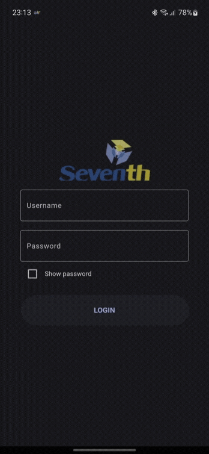
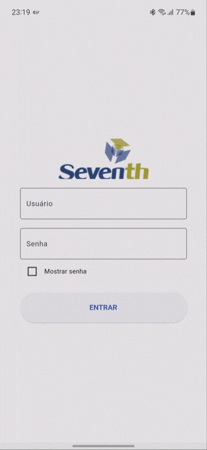

# Seventh Player

## 📱Screens 

  

   </img>
   &nbsp&nbsp&nbsp
    </img>
  

  
## 💻 About

This project lets the user watch a video from the internet. You have to log in with specific credentials to be able to watch the video.

## ✨ Features

- ♿ Accessibility. 
- 🌎 English, Spanish and Portuguese Internalization.
- 🤖 Full Material 3 support.
- 📲 Light and dark theme,
- ➿ Github actions for CI.
- 📈 Unit and integration tests.
- 🖥️ Adaptive sizing.

## 🛠 Technology 🚀

This project was developed using the following libraries and technology:

- <a href="https://flutter.dev/">Flutter 3.7.6 and Flutter Localizations</a>
- <a href="https://pub.dev/packages/chewie">chewie</a> as the Video Player.
- <a href="https://pub.dev/packages/http">http</a> as the Http Client provider.
- <a href="https://pub.dev/packages/shared_preferences">shared_preferences</a> as Data Storage.
- <a href="https://pub.dev/packages/intl">intl</a> as Internalization.
- <a href="https://pub.dev/packages/get_it">get_it</a> as DI.
- <a href="https://pub.dev/packages/mobx">mobx</a> as State manager.
- <a href="https://pub.dev/packages/mockito">mockito</a> as Mock interface.
---
Made with ❤️ by Mariugo 🚀
